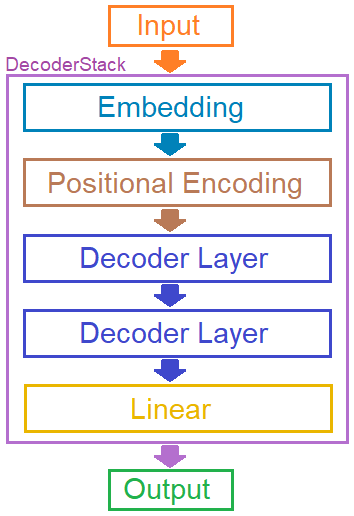

<p></p>

<p>Mireya is a beginner-friendly framework that will allow you to learn the basics of Transformers.</p>

<p>Transformers are a neural network architecture that revolutionized the field of artificial intelligence, especially in natural language processing (NLP) and other areas such as computer vision and bioinformatics. They were introduced in the article "Attention is All You Need" (2017) by Vaswani et al.</p>

<h3 style="margin: 20px 0px;">Applications</h3>

<p>
    <ol>
        <li>
            <p>
                Natural Language Processing (NLP):
                <ol>
                    <li>
                        <p>
                            Models like GPT, BERT, and T5 are based on Transformers.
                        </p>
                    </li>
                    <li>
                        <p>
                            Tasks: translation, text generation, sentiment analysis, etc.
                        </p>
                    </li>
                </ol>
            </p>
        </li>
        <li>
            <p>
                Computer Vision (Vision Transformers - ViT):
                <ol>
                    <li>
                        <p>
                            Transformers have been adapted for images, where they divide them into patches and apply attention to learn relationships between them.
                        </p>
                    </li>
                </ol>
            </p>
        </li>
        <li>
            <p>
                Bioinformatics:
                <ol>
                    <li>
                        <p>In protein modeling and DNA sequencing.</p>
                    </li>
                </ol>
            </p>
        </li>
        <li>
            <p>
                Reinforcement Learning:
                <ol>
                    <li>
                        <p>Use in decision environments, such as policy modeling.</p>
                    </li>
                </ol>
            </p>
        </li>
    </ol>
</p>

<h3 style="margin: 20px 0px;">Popular models based on Transformers</h3>

<p>
    <ol>
        <li>
            <p>
                BERT (Bidirectional Encoder Representations from Transformers):
                <ol>
                    <li>
                        <p>
                            Pretrained with word masking (masked language modeling).
                        </p>
                    </li>
                    <li>
                        <p>
                            It is bidirectional, meaning it analyzes the full context of a sentence.
                        </p>
                    </li>
                </ol>
            </p>
        </li>
        <li>
            <p>
                GPT (Generative Pre-trained Transformer):
                <ol>
                    <li>
                        <p>
                            Focused on text generation. Its most advanced version is GPT-4.
                        </p>
                    </li>
                </ol>
            </p>
        </li>
        <li>
            <p>
                T5 (Text-to-Text Transfer Transformer)::
                <ol>
                    <li>
                        <p>
                            Turn any NLP task into a text input-output problem.
                        </p>
                    </li>
                </ol>
            </p>
        </li>
        <li>
            <p>
                ViT (Vision Transformer):
                <ol>
                    <li>
                        <p>Adapt Transformers for computer vision.</p>
                    </li>
                </ol>
            </p>
        </li>
    </ol>
</p>

<p></p>

- [Description](#description)
- [Installation](#installation)
- [Example](#example)
- [License](#license)

<p></p>

<p>This project has all its files documented with clear and precise descriptions of its components, so you can learn all the parts that make a Transformer work. The main objective with this project is for you to learn all the theory necessary to understand and make your own projects related to Transformers.</p>

<p>This project also has many tests so that you can reinforce the knowledge acquired.</p>

<h3 style="margin: 20px 0px;">How does it work?</h3>

<p>In this library, the transformer is composed of stacks. A stack is an entity that contains the components needed to create an encoder or decoder.</p>

<p>Encoders and Decoders are the main components of the transformer. These components transform the input to produce, for example, the correct word needed in a sentence.</p>

<p>We can set up an example stack like this:</p>

```python
decoders = DecoderStack([
    Embedding(len(source_vocabulary), embedding_dimension),
    PositionalEncoding(embedding_dimension, limit_sequence_length),
    DecoderLayer(embedding_dimension, number_heads, feed_forward_dimension, dropout),
    DecoderLayer(embedding_dimension, number_heads, feed_forward_dimension, dropout),
    Linear(embedding_dimension, len(source_vocabulary))
])
```

<p>To understand it we will diagram it.</p>

<p></p>

<p>The input is pushed onto the stack and is first processed by the first component we placed in the component array. The Embedding component applies the embedding function to the input and returns the result. This result is then pushed to the next component, PositionalEncoding. This component also transforms the input and returns the result to the next component (DecoderLayer). This process, where a change is applied to the input and returned to the next component, repeats until the end.</p>

<p>The output of the stack is the output of the last component and is commonly a vector that is used to obtain the index of the highest numbered element.</p>

<h3 style="margin: 20px 0px;">Components:</h3>

<p>Components are the smallest part of a stack and their purpose is to transform the input received and return it to the next component.</p>

<p>Here is the explanation of all the components:</p>

<p></p>

<p>An embedding is a way of representing discrete data (such as words or tokens) as continuous vectors of numbers. Instead of using words like "hello" or "world," the model works with vectors like:</p>

<p>[0.23, -1.04, 0.88, ..., 0.15] # fixed size, e.g.: 512 dimensions</p>

<p></p>

<p>The PositionalEncoding class adds information about the position of each token in a sequence, allowing the Transformer model 
to be aware of the sequential structure of the data. This is crucial because, unlike recurrent networks (RNNs) or convolutional 
networks (CNNs), Transformers do not process data in an implicit sequential order.</p>

<p></p>

<p>The decoder component takes that compact representation generated by the encoder and generates a desired output.</p>

<p>For example in machine translation:</p>

<p>Encoder: "Hola, ¿cómo estás?" → vector</p>

<p>Decoder: "Hello, how are you?</p>
 
<p></p>

<p>The encoder component takes input data (e.g., a sentence or an image) and converts it into a compact representation or feature vector.</p>

<p>For example, in NLP, the encoder takes a sentence and converts it into a sequence of vectors (or a single one) that represents its meaning.</p>

<p></p>

<p>The Linear Component is a fully connected layer (also known as a dense layer). The linear layer combines information from all the input features and allows the network to generate more complex representations.</p>

<p></p>

<p>The Linear Normalization component is used to apply layer normalization (LayerNorm) to a tensor that is encapsulated in the memory. Normalization serves a key function: improving learning and model stability.</p>

<p></p>
<p>The Shape Transformation component allows you to perform a transformation at the input</p>

<p></p>

```bash
git clone https://github.com/AifaRobot/Mireya.git
cd Mireya
pip install -r requirements.txt
```

<p></p>

<p>In the examples folder you can find already facts like the one you see here:</p>

```python
from translator.translator import Translator
from translator.vocab import spanish_words, english_words, sentences

if __name__ == "__main__":
    translator = Translator(
        spanish_words, 
        english_words, 
        embedding_dimension = 512,
        number_heads = 8,
        number_layers = 6,
        feed_forward_dimension = 2048,
        limit_sequence_length = 100,
        dropout = 0.1
    )

    translator.train(sentences, num_epochs=20)

    translator.translate('cuantos años tienes')
    translator.translate('hola mundo')
    translator.translate('quien eres')
    translator.translate('como estas')
```

<p>To run this example, you need to go to the root folder of the project with the command prompt and run the following command:</p>

<p></p>

<p>The translator will train the transformer with 4 Spanish phrases to be translated into English:</p>

<ol>
    <li>
        <p>
            Hola mundo / Hello world
        </p>
    </li>
    <li>
        <p>
            ¿Cuántos años tienes? / How old are you?
        </p>
    </li>
    <li>
        <p>
            ¿Quién eres? / Who are you?
        </p>
    </li>
    <li>
        <p>
            ¿Como estas? / How are you?
        </p>
    </li>
</ol>

<p></p>

<p>Finally, the phrases previously selected in the training are translated:</p>

<p></p>

<p></p>

<p>This project is licensed under the Apache 2.0 License. See the <a href="/LICENSE.txt">LICENSE</a> file for details.</p>

