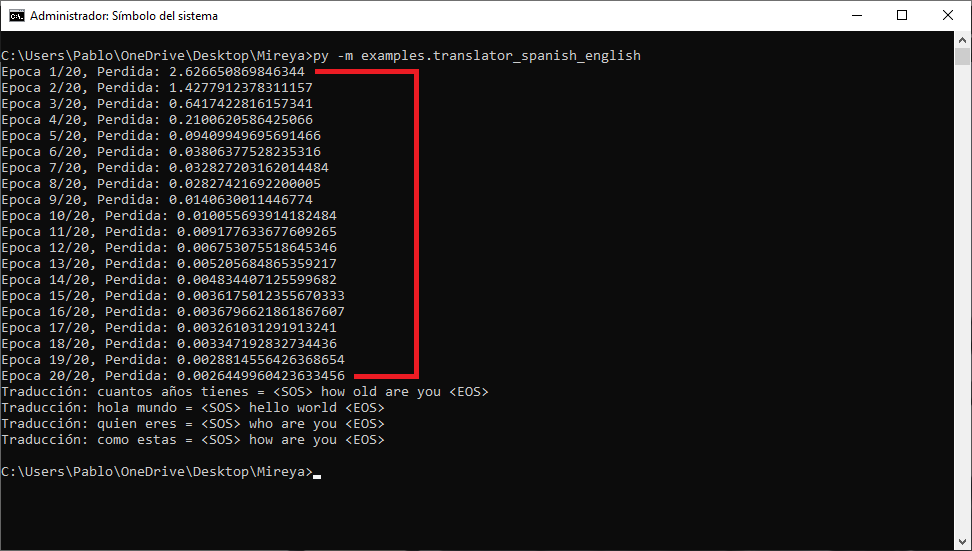

<p></p>

<p>Mireya is a beginner-friendly framework that will allow you to learn the basics of Transformers.</p>

<p>Transformers are a neural network architecture that revolutionized the field of artificial intelligence, especially in natural language processing (NLP) and other areas such as computer vision and bioinformatics. They were introduced in the article "Attention is All You Need" (2017) by Vaswani et al.</p>

<h3 style="margin: 20px 0px;">Applications</h3>

<p>
    <ol>
        <li>
            <p>
                Natural Language Processing (NLP):
                <ol>
                    <li>
                        <p>
                            Models like GPT, BERT, and T5 are based on Transformers.
                        </p>
                    </li>
                    <li>
                        <p>
                            Tasks: translation, text generation, sentiment analysis, etc.
                        </p>
                    </li>
                </ol>
            </p>
        </li>
        <li>
            <p>
                Computer Vision (Vision Transformers - ViT):
                <ol>
                    <li>
                        <p>
                            Transformers have been adapted for images, where they divide them into patches and apply attention to learn relationships between them.
                        </p>
                    </li>
                </ol>
            </p>
        </li>
        <li>
            <p>
                Bioinformatics:
                <ol>
                    <li>
                        <p>In protein modeling and DNA sequencing.</p>
                    </li>
                </ol>
            </p>
        </li>
        <li>
            <p>
                Reinforcement Learning:
                <ol>
                    <li>
                        <p>Use in decision environments, such as policy modeling.</p>
                    </li>
                </ol>
            </p>
        </li>
    </ol>
</p>

<h3 style="margin: 20px 0px;">Popular models based on Transformers</h3>

<p>
    <ol>
        <li>
            <p>
                BERT (Bidirectional Encoder Representations from Transformers):
                <ol>
                    <li>
                        <p>
                            Pretrained with word masking (masked language modeling).
                        </p>
                    </li>
                    <li>
                        <p>
                            It is bidirectional, meaning it analyzes the full context of a sentence.
                        </p>
                    </li>
                </ol>
            </p>
        </li>
        <li>
            <p>
                GPT (Generative Pre-trained Transformer):
                <ol>
                    <li>
                        <p>
                            Focused on text generation. Its most advanced version is GPT-4.
                        </p>
                    </li>
                </ol>
            </p>
        </li>
        <li>
            <p>
                T5 (Text-to-Text Transfer Transformer)::
                <ol>
                    <li>
                        <p>
                            Turn any NLP task into a text input-output problem.
                        </p>
                    </li>
                </ol>
            </p>
        </li>
        <li>
            <p>
                ViT (Vision Transformer):
                <ol>
                    <li>
                        <p>Adapt Transformers for computer vision.</p>
                    </li>
                </ol>
            </p>
        </li>
    </ol>
</p>

<p></p>

- [Description](#description)
- [Installation](#installation)
- [Example](#example)
- [License](#license)

<p></p>

<p>This project has all its files documented with clear and precise descriptions of its components, so you can learn all the parts that make a Transformer work. The main objective with this project is for you to learn all the theory necessary to understand and make your own projects related to Transformers.</p>

<p>This project also has many tests so that you can reinforce the knowledge acquired.</p>

<p></p>

```bash
git clone https://github.com/AifaRobot/Mireya.git
cd Mireya
pip install -r requirements.txt
```

<p></p>

<p>In the examples folder you can find already facts like the one you see here:</p>

```python
from translator.translator import Translator
from translator.vocab import spanish_words, english_words, sentences

if __name__ == "__main__":
    translator = Translator(
        spanish_words, 
        english_words, 
        embedding_dimension = 512,
        number_heads = 8,
        number_layers = 6,
        feed_forward_dimension = 2048,
        limit_sequence_length = 100,
        dropout = 0.1
    )

    translator.train(sentences, num_epochs=20)

    translator.translate('cuantos años tienes')
    translator.translate('hola mundo')
    translator.translate('quien eres')
    translator.translate('como estas')
```

<p>To run this example, you need to go to the root folder of the project with the command prompt and run the following command:</p>

<p></p>

<p>The translator will train the transformer with 4 Spanish phrases to be translated into English:</p>

<ol>
    <li>
        <p>
            Hola mundo / Hello world
        </p>
    </li>
    <li>
        <p>
            ¿Cuántos años tienes? / How old are you?
        </p>
    </li>
    <li>
        <p>
            ¿Quién eres? / Who are you?
        </p>
    </li>
    <li>
        <p>
            ¿Como estas? / How are you?
        </p>
    </li>
</ol>

<p></p>

<p>Finally, the phrases previously selected in the training are translated:</p>

<p></p>

<p></p>

<p>This project is licensed under the Apache 2.0 License. See the <a href="/LICENSE.txt">LICENSE</a> file for details.</p>

